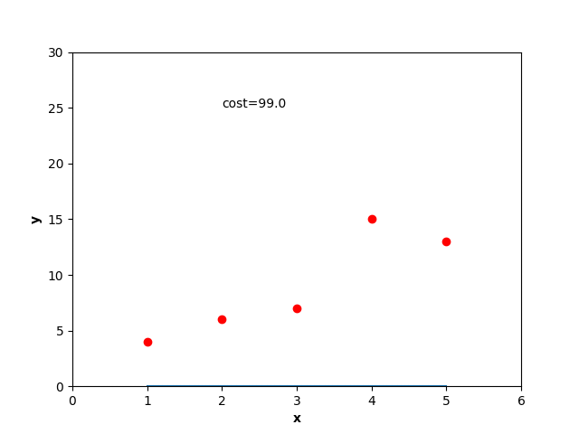

# Visualizing Linear regression


## The essence of the algorithm 
We try and fit a line on a scatter plot of random points. The way the algorithm learns to is where Machine Learning comes in. Fortunately unlike other Machine Learning algorithms, we can see how the model learns to fit this line.  
## Working of Linear Regression with an example
Given a any random data set which has a set of x and y values, lets try and fit a line through this curve.  
```python
x  =  np . array ([ 1 , 2 , 3 , 4 , 5 ]) 
y  =  np . array ([ 4 , 6 , 7 , 15 , 13 ]) 
```


We need to find a line that is closer to all the points, in other words the sum of the distances from all the points to this line must be minimum. 


## Relevant Math 
So we have the random points <a href="https://www.codecogs.com/eqnedit.php?latex=(x_0,y_0),(x_1,y_1),(x_2,y_2)&space;......&space;(x_n,y_n)" target="_blank"></a>  <br /> Now we need to predict a line <a href="https://www.codecogs.com/eqnedit.php?latex=y_{predicted}=mx&space;&plus;&space;c" target="_blank"></a> , such that the distance between all the points and this predicted line, is minimum. Since the difference in this distance can be negative, we square the value and divide the overall value by N (total number of points) <br /> <br />
<a href="https://www.codecogs.com/eqnedit.php?latex=C=Min&space;\left&space;\{&space;\frac{1}{N}\sum_{i=0}^{N}(y_i-y_{predicted})^2&space;\right&space;\}" target="_blank"></a> <br/> <br/>
<a href="https://www.codecogs.com/eqnedit.php?latex=C=Min&space;\left&space;\{&space;\frac{1}{N}\sum_{i=0}^{N}(y_i-(m*x_i&plus;c))^2&space;\right&space;\}" target="_blank"></a> <br /> <br /> So we observe the only variables in the above equations are 'm' and 'c'. We can start plugging in random values of 'm' and 'c' and guess our way to the minima. But the sea of 'm' and 'c' values looks like this. 



